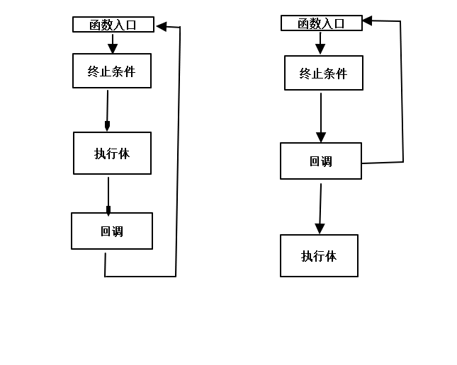

# Basic Algorithm
## 递归
递归的2种使用方式


## 排序
### 冒泡排序
```
for (int i = 1; i < count; i++)
{
	for (int j = 0; j < count-i; j++)
	{
		if (array[j] < array[j + 1])
		{
               change_each_other(array[j], array[j+1]);
		}
	}

}
```

### 选择排序
```
for(int i = count, i>0; --i)//不能让i=0通过, 否则i-1出问题
{
    int index = 0;
    for(int j = 0; j<i; ++j)
    {
        if(array[index] < array[j])//找到最大元素的下标
        {
            index = j;
        }
        change_each_other(array[index], array[i-1]);//放到未排序数组的末尾
    }
}
```
